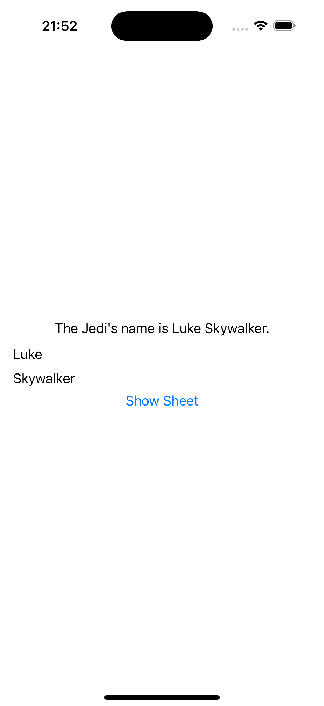

# iExpense
An expense tracker that separates personal costs from business costs (by Paul Hudson - @twostraws).

There are several ways of showing views in SwiftUI, and one of the most basic is a sheet: a new view presented on top of our existing one. On iOS this automatically gives us a card-like presentation where the current view slides away into the distance a little and the new view animates in on top.

Sheets work much like alerts, in that we don’t present them directly with code such as ```mySheet.present()``` or similar. Instead, we define the conditions under which a sheet should be shown, and when those conditions become true or false the sheet will either be presented or dismissed respectively.




