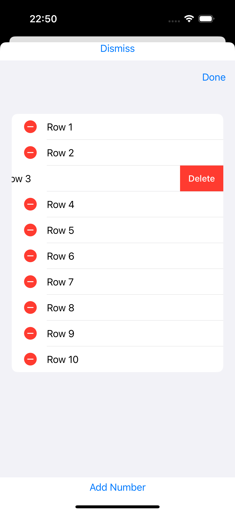

# iExpense
An expense tracker that separates personal costs from business costs (by Paul Hudson - @twostraws).

SwiftUI gives us the ```onDelete()``` modifier for us to use to control how objects should be deleted from a collection. In practice, this is almost exclusively used with ```List``` and ```ForEach```: we create a list of rows that are shown using ```ForEach```, then attach ```onDelete()``` to that ```ForEach``` so the user can remove rows they don’t want.

This is another place where SwiftUI does a heck of a lot of work on our behalf, but it does have a few interesting quirks.


