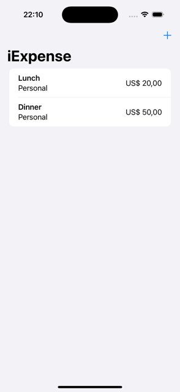
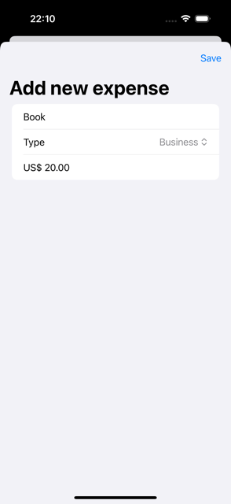
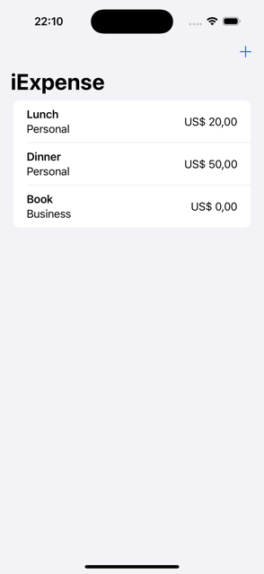

# iExpense
An expense tracker that separates personal costs from business costs (by Paul Hudson - [@twostraws](https://x.com/twostraws)).

### Project 12 - Challenge 1: Start by upgrading it to use SwiftData 

Source URL: [link](https://www.hackingwithswift.com/books/ios-swiftui/swiftdata-wrap-up)

Branch: `project-12-challenge-1`